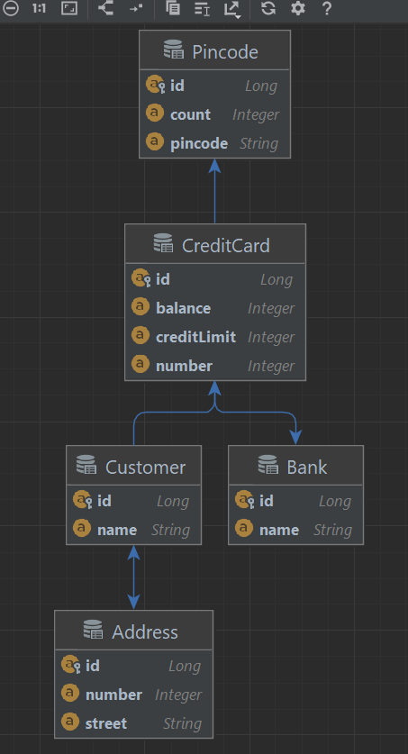
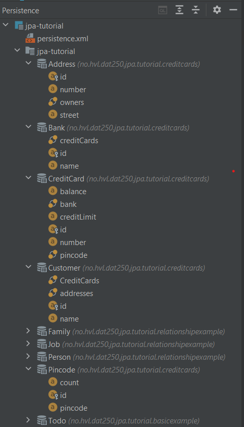

i didn't have any technical problems with jpa 

i used the persistence tab in intellij to check the database and the entity releationship diagram

 

Struggled a bit with two of the tests becouse i returned a list instead of a set but found it out in the end.